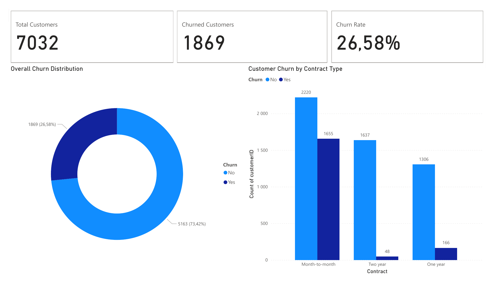

# Telco Customer Churn & Retention Analysis

> Analysing **7,032 telecom customers** to find who is leaving, why, and where retention spend should go.



[](https://www.python.org/)
[](https://www.mysql.com/)
[](https://powerbi.microsoft.com/)

## Key Results

| Metric | Finding |
| --- | --- |
| **Overall churn rate** | **26.58%** — 1,869 of 7,032 customers left |
| **Highest-risk segment** | **Month-to-month contracts** — 1,655 churned (by far the largest group) |
| **Most loyal segment** | **Two-year contracts** — only 48 churned |
| **Retention lever** | Moving month-to-month customers onto longer contracts is the single biggest opportunity |

## The Problem

A telecommunications provider was losing customers without a clear picture of *which* segments were leaving or *why*. Retention budget was being spent evenly instead of where the risk actually sat.

## Approach

1. **Cleaned** the raw 7,032-row dataset in Python (Pandas) — handled missing values, fixed data types, and exported an analysis-ready file.
2. **Explored** churn against contract type, tenure, payment method, and services to isolate the strongest predictors.
3. **Queried** the cleaned data with SQL to quantify churn rates per segment.
4. **Built** an interactive Power BI dashboard so the business can see churn risk at a glance and drill into any segment.

## What the Data Shows

- Churn is concentrated in **month-to-month** contracts — these customers have no commitment and the least friction to leave.
- **Two-year** customers are extremely sticky (48 churns), confirming contract length as the dominant loyalty driver.
- The clearest, cheapest win is an **onboarding-to-annual-contract** push aimed at new, month-to-month customers.

## Repository Structure

```
├── data/          Raw dataset (WA_Fn-UseC_-Telco-Customer-Churn.csv)
├── exports/       Cleaned, analysis-ready data
├── notebook/      Jupyter notebooks — cleaning + exploratory analysis
├── sql/           Segment churn queries
├── dashboard/     Power BI file (.pbix) + PDF export
└── images/        Dashboard preview
```

## Run It Yourself

1. Open the notebooks in `notebook/` to reproduce the cleaning and EDA.
2. Load `exports/telco_churn_cleaned.csv` into any SQL engine and run `sql/churn_queries.sql`.
3. Open `dashboard/Telco Churn Rate.pbix` in Power BI Desktop, or view the PDF for a no-install preview.

---

**Baxolele Mazwi** — BSc Construction student at Wits & aspiring data scientist
[Portfolio](https://mazwiibaxolele.github.io/mazwi-portfolio/) · [LinkedIn](https://linkedin.com/in/baxolele-mazwi-9b2322267)
